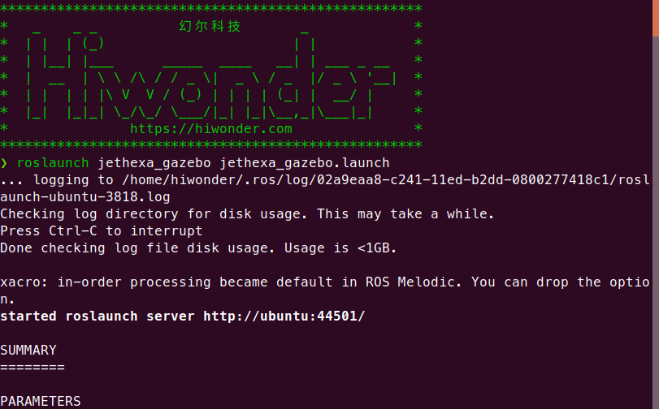
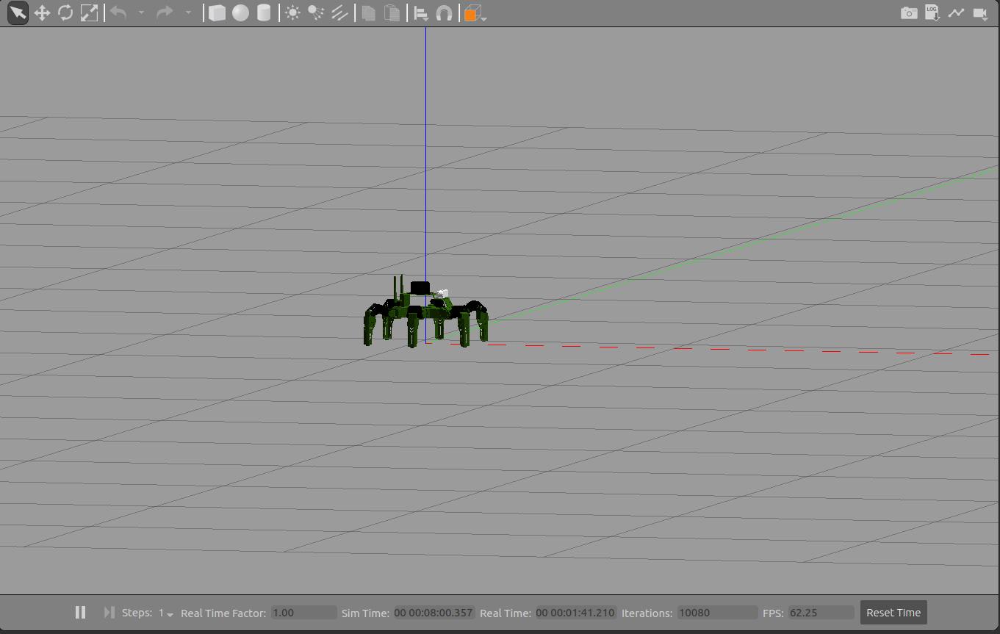
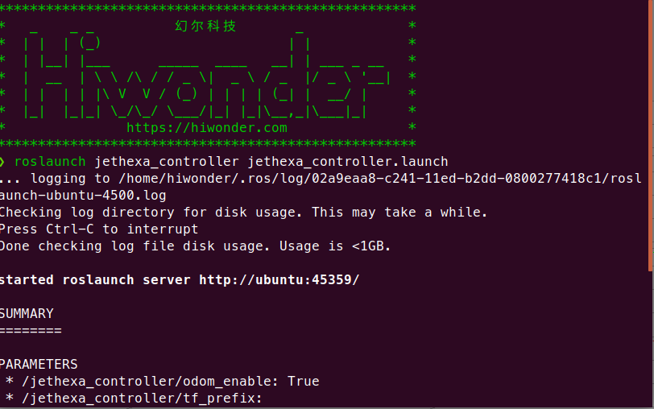
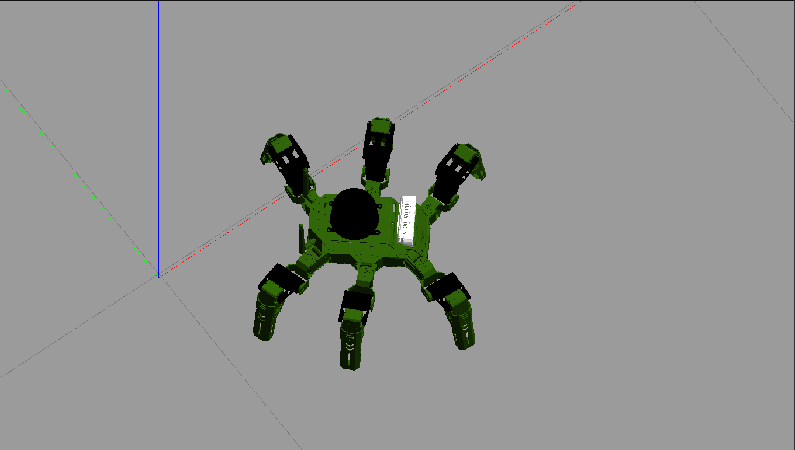

#jethexa_vm

##begin

1.roslaunch jethexa_gazebo jethexa_gazebo.launch  
  

  

2.roslaunch jethexa_controller jethexa_controller.launch  

  

3.rostopic pub /jethexa_controller/traveling jethexa_controller_interfaces/Traveling "{gait: 2, stride: 30.0, height: 20.0, direction: 0.0, rotation: 0.0, time: 0.8, steps: 30,
  relative_height: false, interrupt: false}"  

  

